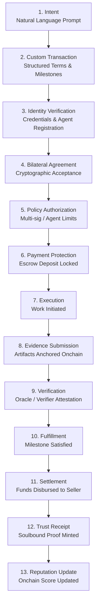
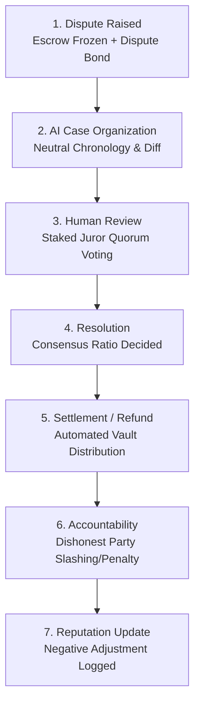

# VeriqoMesh Network Transaction Lifecycle & Deterministic State Machine

## 1. Lifecycle Overview

The TrustMesh protocol operates through two tightly specified lifecycles:
1. **The Primary Transaction Lifecycle (Happy Path)**
2. **The Dispute & Adjudication Lifecycle (Contested Path)**

All state transitions are deterministically verified by the onchain smart contract engine (`TrustMeshEscrow.sol`). Arbitrary transitions, out-of-order execution, or unauthenticated state leaps are rejected at the EVM opcode level.

---

## 2. Happy-Path Lifecycle



### Detailed Happy-Path Stages

1. **INTENT**: The user inputs an unstructured natural language description (e.g., *"Build an ERC-20 staking contract with 14-day timelock for 500 MON, due in 10 days"*).
2. **CUSTOM TRANSACTION**: The AI engine translates the intent into a structured contractual schema with explicit milestones, deliverables, deadlines, and dispute parameters.
3. **IDENTITY**: Parties' cryptographic addresses, DIDs, or ERC-8004 AI agent identities are validated against the transaction's configured identity requirements.
4. **AGREEMENT**: The counterparty reviews terms and counter-signs the proposal cryptographically.
5. **AUTHORIZATION**: Corporate policy gates, multisig quorum thresholds, or AI agent daily spending limits are verified.
6. **PROTECTION**: The buyer deposits the required escrow (native MON or ERC-20 tokens) into the non-custodial `TrustMeshEscrow` contract.
7. **EXECUTION**: Escrow locking signals the seller (human or AI agent) to begin execution.
8. **EVIDENCE**: Deliverables (code commits, IPFS documents, API proofs) are submitted; SHA-256 / Keccak-256 hashes are anchored onchain.
9. **VERIFICATION**: Independent verifiers or automated oracles check the deliverable against predefined criteria.
10. **FULFILLMENT**: Deliverable verification passes, fulfilling the contractual terms.
11. **SETTLEMENT**: The smart contract releases escrow funds directly to the seller.
12. **TRUST RECEIPT**: A soulbound cryptographic receipt (ERC-721/1155) is minted, providing permanent, portable proof of successful completion.
13. **REPUTATION**: Both participants' verifiable onchain reputation vectors are updated positively.

---

## 3. Dispute & Adjudication Lifecycle

When either party alleges breach of agreement, non-delivery, or defective work, the transaction branches into the dispute lifecycle:



### Detailed Dispute Stages

1. **DISPUTE**: Either party raises a dispute prior to release. The escrow is immediately frozen into `DISPUTED` state, preventing unilateral withdrawal. The initiator deposits a dispute bond to deter spam.
2. **AI CASE ORGANIZATION**: The AI service aggregates evidence, chat records, and milestones into a neutral, chronological dispute docket highlighting factual discrepancies. **Crucially, the AI is strictly prohibited from rendering a ruling.**
3. **HUMAN REVIEW**: Staked human jurors from the TrustMesh Judge Network review the docket and cast blind votes specifying the equitable percentage split (0% to 100%).
4. **RESOLUTION**: Votes are revealed and tallied onchain. If consensus quorum is reached, the final settlement ratio is locked into state `RESOLVED`.
5. **SETTLEMENT / REFUND / REMEDY**: The smart contract releases funds proportionally according to the adjudicated ratio.
6. **ACCOUNTABILITY**: If one party engaged in proven bad faith (e.g. fabricated evidence), their dispute bond is forfeited or their stake is slashed.
7. **REPUTATION UPDATE**: Verified outcomes update participants' onchain reputation records accordingly.

---

## 4. Deterministic 14-State Machine Specification

```
                          +------------------------+
                          |         DRAFT          |
                          +-----------+------------+
                                      |
                                      v
                          +------------------------+
           +------------> |        PROPOSED        |<-----------+
           |              +-----------+------------+            |
           |                          |                         |
           |                          v                         |
           |              +------------------------+            |
           +--------------|      NEGOTIATING       |------------+
                          +-----------+------------+
                                      |
                                      v
                          +------------------------+
                          |         AGREED         |
                          +-----------+------------+
                                      |
                                      v
                          +------------------------+
                          |         FUNDED         |-------+
                          +-----------+------------+       |
                                      |                    |
                                      v                    |
                          +------------------------+       |
                          |      IN_PROGRESS       |---+   |
                          +-----------+------------+   |   |
                                      |                |   |
                                      v                |   |
                          +------------------------+   |   |
           +------------> |   EVIDENCE_SUBMITTED   |   |   |
           |              +-----------+------------+   |   |
           |                          |                |   |
           |                          v                |   |
           |              +------------------------+   |   |
           +--------------|      VERIFICATION      |   |   |
                          +-----+------------+-----+   |   |
                                |            |         |   |
                                |            v         v   v
                                |         +--------------------+
                                |         |      DISPUTED      |
                                |         +----------+---------+
                                |                    |
                                |                    v
                                |         +--------------------+
                                |         |      JUDGING       |
                                |         +----------+---------+
                                |                    |
                                |                    v
                                |         +--------------------+
                                |         |      RESOLVED      |
                                |         +-----+--------+-----+
                                |               |        |
                                v               v        v
                        +---------------+ +---------------+
                        |    SETTLED    | |   REFUNDED    |
                        +---------------+ +---------------+
                               [TERMINAL]        [TERMINAL]

                  (Note: CANCELLED is reachable from DRAFT,
                   PROPOSED, NEGOTIATING, AGREED, and FUNDED)
```

---

## 5. State Transition Rules & Trigger Matrix

| Current State | Next Allowed State(s) | Trigger / Action | Authorization Guard |
| :--- | :--- | :--- | :--- |
| **`DRAFT`** | `PROPOSED`, `CANCELLED` | `PROPOSE`, `CANCEL` | Creator |
| **`PROPOSED`** | `NEGOTIATING`, `AGREED`, `CANCELLED` | `COUNTER_OFFER`, `ACCEPT_TERMS`, `CANCEL` | Counterparty or Creator |
| **`NEGOTIATING`**| `PROPOSED`, `AGREED`, `CANCELLED` | `COUNTER_OFFER`, `ACCEPT_TERMS`, `CANCEL` | Both Parties |
| **`AGREED`** | `FUNDED`, `CANCELLED` | `DEPOSIT_ESCROW`, `CANCEL` | Buyer (Deposit) or Mutual Cancel |
| **`FUNDED`** | `IN_PROGRESS`, `DISPUTED`, `CANCELLED` | `START_WORK`, `RAISE_DISPUTE`, `CANCEL` | Seller (Start), Either (Dispute) |
| **`IN_PROGRESS`**| `EVIDENCE_SUBMITTED`, `DISPUTED` | `SUBMIT_EVIDENCE`, `RAISE_DISPUTE` | Seller (Evidence), Either (Dispute) |
| **`EVIDENCE_SUBMITTED`**| `VERIFICATION`, `DISPUTED` | `REQUEST_VERIFICATION`, `RAISE_DISPUTE`| Either Party |
| **`VERIFICATION`**| `SETTLED`, `EVIDENCE_SUBMITTED`, `DISPUTED` | `CONFIRM_FULFILLMENT`, `REVISE_EVIDENCE`, `RAISE_DISPUTE`| Verifier / Buyer / Counterparty |
| **`DISPUTED`** | `JUDGING` | `ASSIGN_JUDGES` | Dispute Coordinator Contract |
| **`JUDGING`** | `RESOLVED` | `RENDER_VERDICT` | Staked Judge Quorum |
| **`RESOLVED`** | `SETTLED`, `REFUNDED` | `EXECUTE_SETTLEMENT`, `EXECUTE_REFUND` | Smart Contract Vault |
| **`SETTLED`** | *(None - Terminal)* | Protocol completion | - |
| **`REFUNDED`** | *(None - Terminal)* | Protocol completion | - |
| **`CANCELLED`** | *(None - Terminal)* | Protocol termination | - |

---

## 6. Mathematical Invariants

1. **Conservation of Value**:
   $$\text{DepositedEscrow} + \text{DisputeBonds} = \text{DisbursedSettlement} + \text{Refunds} + \text{JurorFees} + \text{ProtocolFees}$$
2. **Terminal Non-Reversibility**:
   $$\forall s \in \{\text{SETTLED}, \text{REFUNDED}, \text{CANCELLED}\}, \quad \text{NextStates}(s) = \emptyset$$
3. **Deterministic Progression**:
   $$\text{Transition}(S_t, \text{Event}) = S_{t+1} \quad \text{where } S_{t+1} \in \text{VALID\_TRANSITIONS}[S_t]$$
